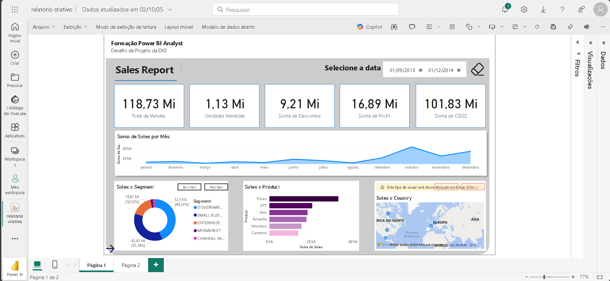
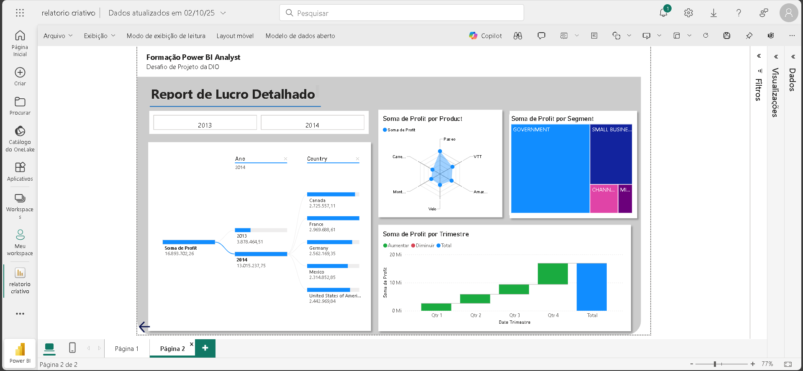

# 📊 Projeto de Análise de Vendas e Lucros - Power BI

Este projeto faz parte da **Formação Power BI Analyst (DIO)** e tem como objetivo a criação de um relatório interativo no **Power BI Desktop**, apresentando análises de vendas, lucros, unidades vendidas, produtos e segmentos de mercado.  

O relatório foi desenvolvido a partir de **dados fictícios**, apenas para fins educacionais e práticos.

---

## 🗂️ Estrutura do Relatório

O dashboard foi dividido em **duas páginas principais**:

### 🔹 Página 1 - Sales Report

Principais indicadores exibidos:
- **Total de Vendas:** 118,73 Mi  
- **Unidades Vendidas:** 1,13 Mi  
- **Descontos Aplicados:** 9,21 Mi  
- **Lucro Total:** 16,89 Mi  
- **Soma de COGS (Custos):** 101,83 Mi  

Visuais incluídos:
- Evolução de vendas por mês (linha do tempo)  
- Distribuição de vendas por **segmento**  
- Ranking de vendas por **produto**  
- Vendas por **país** (mapa interativo)  

---

### 🔹 Página 2 - Report de Lucro Detalhado

Principais análises:
- **Lucro por Ano e País**  
- **Lucro por Produto** (gráfico radar)  
- **Lucro por Segmento** (treemap)  
- **Lucro por Trimestre** (gráfico de cascata)  

---

## 🚀 Tecnologias Utilizadas
- **Power BI Desktop**  
- **Modelagem e transformação de dados** no Power Query  
- **DAX (Data Analysis Expressions)** para cálculos e medidas personalizadas  

---

## 📈 Principais Insights
- O segmento **Government** é responsável pela maior parte do lucro.  
- Entre os países, **Canadá e França** apresentaram maior lucratividade em 2014.  
- O produto **Paseo** possui melhor desempenho em termos de margem de lucro.  
- Houve crescimento constante de lucro ao longo dos trimestres analisados.  

---

## 🏆 Conclusão
Este dashboard demonstra como o **Power BI** pode ser utilizado para transformar dados brutos em **insights acionáveis**, permitindo tomadas de decisão estratégicas baseadas em indicadores claros de **vendas e lucratividade**.

📌 *Observação: Todos os dados são fictícios e utilizados apenas para fins de estudo.*  

---
👨‍💻 Desenvolvido durante a Formação **Power BI Analyst - DIO**
